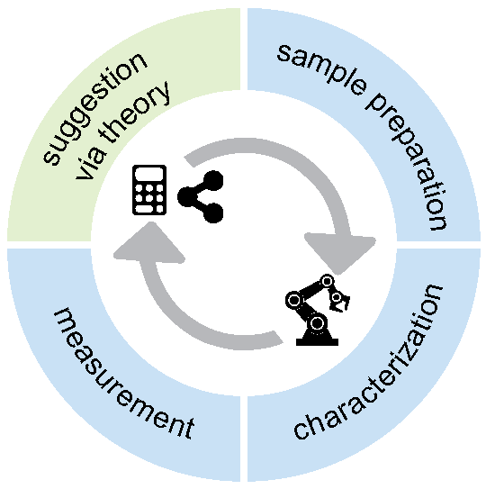
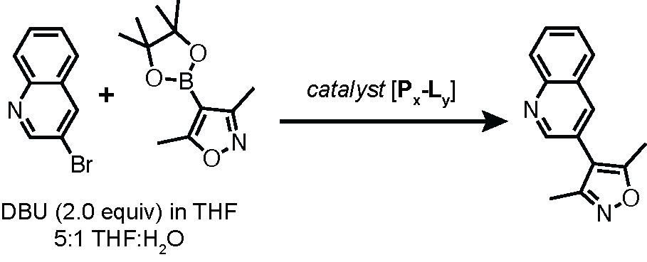
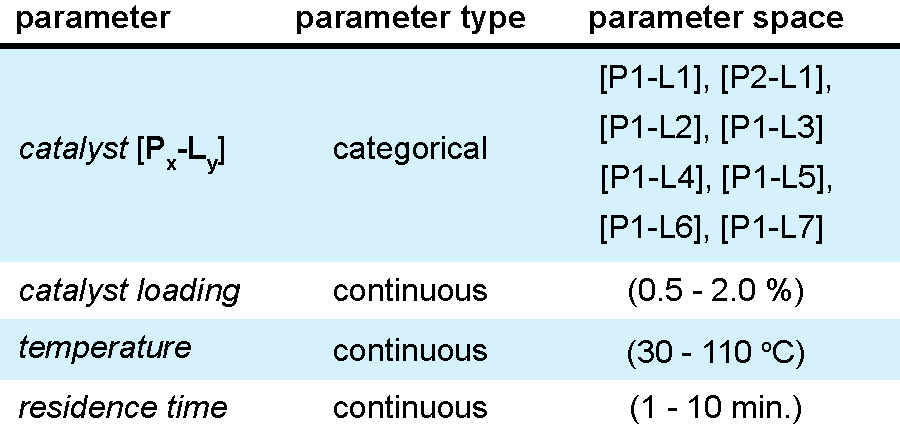
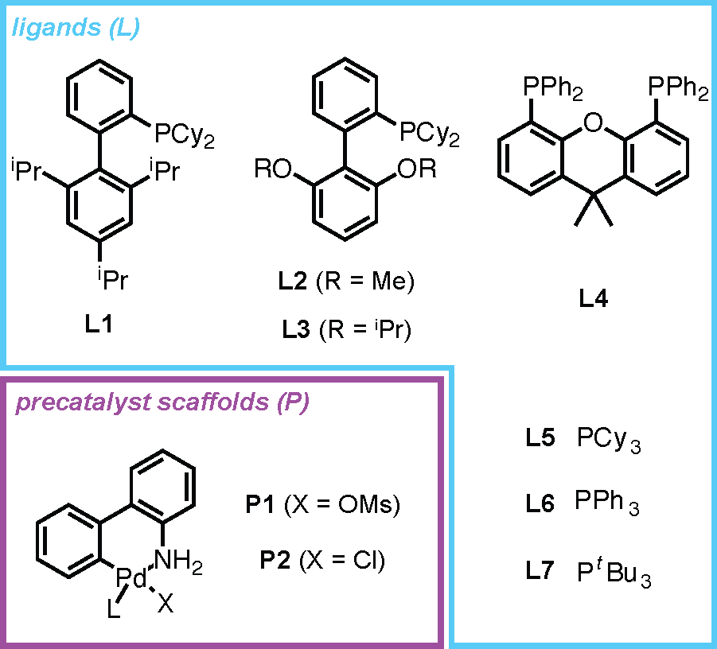

<h1 align="center">
    <br>
    
    <br>
    Bayesian optimization for guided chemical design
    <br>
</h1>

<h4 align="center">Notebooks and scripts to support the materials delivered at the Sargent Centre for Process Systems Engineering 2024 BO Summer School and the 2024 AIchemy BO for Chemistry workshop.</h4>

<p align="center">
    <a href="#overview">overview</a> •
    <a href="#installation-instructions">installation instructions</a> •
    <a href="#case-study-descriptions">case study descriptions</a> •
    <a href="#additional-resources">additional resources</a> •
</p>

<br>

## overview

This repo contains tutorial notebooks featuring BO for two chemical tasks. We explore implementing BO using several available packages, including BayBE, BOFire, and BOTorch.

## installation instructions

We encourage you to take advantage of Google colab to run the tutorial notebooks included in this repository. Should you wish to run them locally, please follow the installation instructions below:

```console
foo@bar:~$ git clone https://github.com/austin-mroz/2024-BO-summer-school
foo@bar:~$ cd 2024-BO-summer-school
foo@bar:~$ conda env create -p ./.venv -f environment.yml
foo@bar:~$ conda activate ./.venv
```

## case study descriptions

### catalysis

To help you get familiar with all that Web-BO has to offer, we provide an optimization case study that takes advantage of existing reaction emulators to acquire the experimental measurements.

This case study concerns optimizing the coupling of 3-bromoquinoline with
3,5-dimethylisoxazole-4-boronic acid pinacol ester in the presence of
1,8-diazobicyclo[5.4.0]undec-7-ene (DBU) and THF/water, Figure 1.

<h5 align="center">


Figure 1. Suzuki-Miyaura cross-coupling reaction involved in this case study.
</h5>
The parameter space involved in this optimisation task is detailed in Figure 2.

<h5 align="center">


Figure 2. Parameter space spanned by this
case study includes 3 continuous variables (catalyst loading, temperature,
and residence time) and 1 categorical variable (catalyst).
</h5>
The catalyst options are presented in Figure 3.

<h5 align="center">


Figure 3. The catalyst options included in
this study.

</h5>

This case study takes advantage of the experiment emulators offered by the <a    href="https://github.com/sustainable-processes/summit" class="tooltip-test" title="Tooltip">Summit</a> package. Specifically, the <a href="https://gosummit.readthedocs.io/en/latest/experiments_benchmarks/implemented_benchmarks.html#cross-coupling-emulator-benchmarks" class="tooltip-test" title="Tooltip">Suzuki-Miyaura Cross Coupling Emulator</a>.

### covalent-organic framework design

## additional resources

There are a wealth of additional tutorials on the general BO framework, as well as materials specifically featuring BO for chemical tasks. (This is not an exhaustive list)

### general BO tutorials and notebooks

* [GPs hands-on code tutorial](https://github.com/joelpaulson/Sargent_Centre_BO_Summer_School_2024/blob/main/GP_Hands_On_Code_Tutorial.ipynb)

### chemistry-specific tutorials and examples

#### [GAUCHE](https://leojklarner.github.io/gauche) tutorials
* [Bayesian Optimisation Over Molecules](https://leojklarner.github.io/gauche/notebooks/bayesian_optimisation_over_molecules.html)
* [Multioutput Gaussian Processes for Multitask Learning](https://leojklarner.github.io/gauche/notebooks/multitask_gp_regression_on_molecules.html)

#### BO for COFs
* [BO for COFs](https://github.com/SimonEnsemble/BO_of_COFs)
* [MFBO for COFs](https://github.com/SimonEnsemble/multi-fidelity-BO-of-COFs-for-Xe-Kr-seps/tree/master/run_BO)